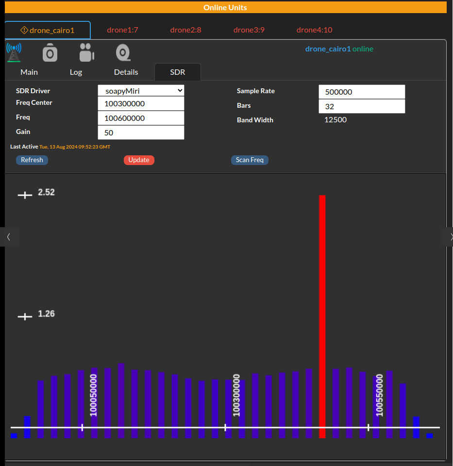

 **Drone Engage** is part of Ardupilot Cloud Eco System

------------

 
#Drone Engage SDR Plugin

Drone-Engage is a versatile platform that enables seamless communication and control of drones, as well as a wide range of integrated modules. These modules can be carried by drones or operated independently as fixed or mobile units. The system's open-design facilitates communication and control of these drones, units, and modules from web-based Ground Control Stations.

The Drone-Engage SDR module is a C++ component that uses a famous SoapySDR library to control SDR hardware. This is a famous library and able to control many SDR hardware brands.

The system is able to read frequencies on any range supported by the hardware and uses FFT transform to generate  a frequency diagram of the signal.

In this implementation data is collected and sent to WebClient to display on screen.

This firmware has ben tested on Raspberry PI and Ubuntu 22.04 and it worked nice.

##How to Compile

We nee to compile and install some components before compiling plugin. Process is straight forward and should work smoothly.

### 1- Compile & Install SoapySDR

https://github.com/HefnySco/SoapySDR?tab=readme-ov-file

sudo apt-get install cmake g++ libpython3-dev python3-numpy swig

    git clone https://github.com/HefnySco/SoapySDR.git  
    cd SoapySDR.git
    mkdir build
    cd build
    cmake ..
    make 
    sudo make install
	
	

### 2- Compile & Install LiquidSDR

    wget https://liquidsdr.org/downloads/liquid-dsp-1.6.0.tar.gz
    cd liquid-dsp-1.6.0
    ./configure
    make
    sudo make install
    
    Install FFTW3
    sudo apt-get install -y libfftw3-dev
	
	

### Install FFTW3

`sudo apt-get install -y libfftw3-dev`

### Installl SDR Specific Driver

In my test I use MSI2500 so I need to install its driver

    git clone https://github.com/HefnySco/libmirisdr-5 
    cd libmirisdr-5
    mkdir build
    cd build
    cmake -DBUILD_UTILS=ON ..
    make
    sudo make install

and the you need to instakk Miri Module for SoapySDR

    git clone https://github.com/HefnySco/dsp_SoapyMiri.git
    cd dsp_SoapyMiri.git 
    mkdir build
    cd build
    make
    sudo make install
	
	

